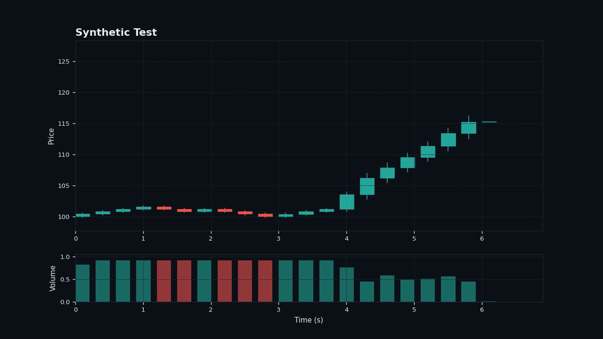

# Classical Candles

**What if Beethoven had a Bloomberg Terminal?**

Classical Candles turns any classical music track into a live stock-market candlestick chart. Feed it a YouTube link — a violin concerto, a piano sonata, anything — and it downloads the audio, listens to it, and "trades" it: every sharp, fast passage sends the price rocketing, every falling melody dumps it, and every calm sustained note just... consolidates. The output is an MP4 with the chart animating in perfect sync with the music.

100% offline. No exchange was harmed in the making of this chart.


`classical-music` `stock-market` `candlestick-chart` `audio-analysis` `music-visualization` `librosa` `data-sonification` `generative-art` `yt-dlp` `matplotlib` `python`

---

## How it works

1. **Download** — `yt-dlp` grabs the audio from your YouTube link (or you can point it at a local file).
2. **Listen** — [`librosa`](https://librosa.org/) analyzes the waveform frame by frame, extracting:
   - **Loudness** (RMS energy)
   - **Onset strength** — how sharp each note's attack is
   - **Onset density** — how many sharp attacks per second (i.e. how *fast* the passage is)
   - **Spectral brightness** (centroid)
   - **Melody pitch** (via `pyin` pitch tracking)
3. **Trade** — those features get chopped into fixed-length time windows ("candles") and mapped into OHLCV data.
4. **Chart it** — a scrolling, animated candlestick chart is rendered frame-by-frame and the original audio is muxed back in with `ffmpeg`.

### The market rules

| Musical event | Market reaction |
|---|---|
| 🎻 Melody pitch rises | Candle turns **green** (bullish) |
| 🎻 Melody pitch falls | Candle turns **red** (bearish) |
| ⚡ Sharp *and* fast notes (rapid bowing, trills, runs) | Bigger candle body — **high volatility**, price moves hard |
| 🎹 Slow, sustained, calm notes | Small candle body — market is quiet |
| ✨ Bright, percussive transients | Longer wicks — sudden spikes/rejections |
| 🔊 Loud passages | Taller volume bars |
| 🤫 Quiet passages | Thin volume bars |

So a slow adagio opening will look like a flat, sleepy market — and the moment the violins launch into a fast, sharp allegro run, you'll watch the chart break out into a rally (or a crash, depending on where the melody is headed).

## Demo

A calm sustained passage followed by a fast rising violin run — the chart stays flat, then rallies hard exactly when the run kicks in:



## Requirements

- Python 3.10+
- [FFmpeg](https://ffmpeg.org/download.html) installed and on your `PATH` (used for audio extraction, video encoding, and audio muxing)

## Install

```bash
git clone https://github.com/MAXIVA11/Classical_Candles.git
cd Classical_Candles
pip install -r requirements.txt
```

## Usage

From a YouTube link:

```bash
python main.py --url "https://www.youtube.com/watch?v=XXXXXXXXXXX"
```

From a local audio file:

```bash
python main.py --input-audio "my_song.mp3"
```

The finished video lands in `output/<title>.mp4`.

### Options

| Flag | Default | Description |
|---|---|---|
| `--url` | — | YouTube URL to download and analyze |
| `--input-audio` | — | Path to a local audio file instead of downloading |
| `--output` | `output/<title>.mp4` | Output video path |
| `--title` | video/file title | Chart title override |
| `--candle-duration` | `0.4` | Seconds of audio per candle. Lower = more frantic, higher-frequency chart |
| `--visible-candles` | `50` | How many candles are on screen at once |
| `--fps` | `30` | Output video frame rate |
| `--start-price` | `100.0` | Starting price of the "stock" |
| `--max-move-pct` | `0.045` | Max body size per candle, as a fraction of price |
| `--max-wick-pct` | `0.02` | Max wick size per candle, as a fraction of price |
| `--no-pitch` | off | Skip melody pitch tracking (faster, but direction becomes loudness-driven only) |
| `--cache-dir` | `cache` | Where downloaded audio is cached |

### Example

```bash
python main.py --url "https://www.youtube.com/watch?v=XXXXXXXXXXX" \
  --title "Vivaldi - Summer, Presto" \
  --candle-duration 0.25 \
  --visible-candles 60
```

Shorter `--candle-duration` values work great for fast, virtuosic pieces (think Paganini or Vivaldi's *Summer*); longer values suit slower, more spacious pieces.

## Project layout

```
classical_candles/
  downloader.py   # yt-dlp wrapper: URL -> WAV
  analysis.py     # librosa feature extraction: WAV -> per-frame features
  candles.py      # the actual "music -> market" mapping: features -> OHLCV candles
  render.py       # matplotlib animation + ffmpeg muxing: candles -> MP4
  cli.py          # glues it all together
main.py           # entry point
```

## Notes & disclaimers

- This is a **sonification / visualization toy**, not a real trading signal, financial product, or investment advice. Please do not YOLO your savings into "Moonlight Sonata."
- Only download audio you have the right to use. Respect YouTube's Terms of Service and copyright law in your jurisdiction.
- Melody pitch tracking (`pyin`) is the slowest step — expect it to take a bit longer than real-time on long tracks. Use `--no-pitch` for a quick loudness/rhythm-only preview.

## License

MIT — see [LICENSE](LICENSE).
