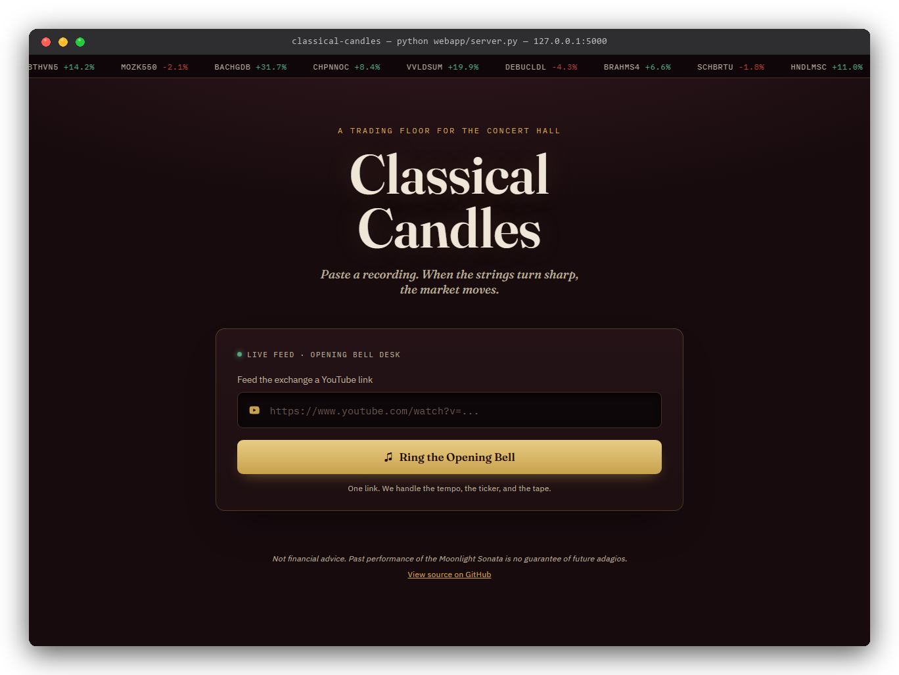

<div align="center">

# 🕯️📈 Classical Candles

**Classical music, traded live as a stock chart.**

Paste a YouTube link. Sharp violin runs rally the price. A falling melody dumps it. A held note flatlines.




</div>

## Quick start

```bash
git clone https://github.com/MAXIVA11/Classical_Candles.git
cd Classical_Candles
./setup.sh          # Windows: setup.bat
python webapp/server.py
```

Open **http://127.0.0.1:5000**, paste a link, ring the bell. The setup script creates a virtualenv and checks for [FFmpeg](https://ffmpeg.org/download.html), which you'll need on your `PATH`.

## How the market moves

| Music | Market |
|---|---|
| Melody rises | 🟢 Green candle |
| Melody falls | 🔴 Red candle |
| Fast, sharp notes | Big candle, high volatility |
| Slow, sustained notes | Small candle, quiet market |
| Bright, percussive hits | Long wick |
| Loud + busy passage | Tall volume bar, bigger moves (real markets trade the same way) |
| Tempo | Sets candle speed |
| Title | Becomes the ticker, exchange, and IPO price |

The chart draws live in your browser, synced to playback, no video render needed. Want a file? Hit **Save as Video**.

## Under the hood

`yt-dlp` downloads → `librosa` analyzes loudness, tempo, and melody → a ticker gets minted from the title → features become OHLCV candles → your browser paints them live on a `<canvas>`.

Terminal fan? `python main.py --url "..."` skips the browser.

## Fine print

Not financial advice. Only use audio you have the rights to. MIT licensed, see [LICENSE](LICENSE).
